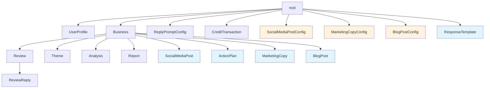

# Content Generation Feature Plan

> **Status**: Implementation-Ready Design Document
> **Last Updated**: 2026-02-06
> **Scope**: 5 content generation features for Review Analyzer SaaS
> **Target Codebase**: Jaclang (JAC) graph-based architecture

---

## Table of Contents

1. [Executive Summary](#1-executive-summary)
2. [Architecture Overview](#2-architecture-overview)
3. [Data Model Extensions](#3-data-model-extensions)
4. [Feature 1: Response Template Library](#4-feature-1-response-template-library)
5. [Feature 2: Action Plan Generator](#5-feature-2-action-plan-generator)
6. [Feature 3: Social Media Post Generator](#6-feature-3-social-media-post-generator)
7. [Feature 4: Marketing Copy Generator](#7-feature-4-marketing-copy-generator)
8. [Feature 5: Blog Post Generator](#8-feature-5-blog-post-generator)
9. [Credit and Pricing Model](#9-credit-and-pricing-model)
10. [Implementation Roadmap](#10-implementation-roadmap)
11. [Cross-Feature Interactions](#11-cross-feature-interactions)
12. [Error Handling and Edge Cases](#12-error-handling-and-edge-cases)
13. [Rate Limiting and Abuse Prevention](#13-rate-limiting-and-abuse-prevention)
14. [Testing Strategy](#14-testing-strategy)

---

## 1. Executive Summary

### Purpose

The Review Analyzer platform already produces rich business intelligence: sentiment analysis, theme extraction, SWOT analysis, health scores, brand-aware recommendations, delighters, pain points, and trend data. This plan designs five content generation features that transform that intelligence into actionable, publishable content.

### Features at a Glance

| Feature | Priority | Effort | Tier | Credit Cost | LLM Calls |
|---------|----------|--------|------|-------------|-----------|
| Response Template Library | HIGH | Low | Free | 0 (templates) / 0.25 (customized) | 0 or 1 |
| Action Plan Generator | HIGH | Medium | Premium | 0.5 per plan | 1 |
| Social Media Post Generator | MEDIUM | Low | Premium | 0.25 per batch (up to 5 posts) | 1 |
| Marketing Copy Generator | MEDIUM | Low | Premium | 0.25 per batch (up to 3 variants) | 1 |
| Blog Post Generator | LOW | Medium | Premium | 1.0 per blog post | 1-2 |

### Value Proposition

- **Response Template Library**: Reduces reply time from minutes to seconds; free tier drives user acquisition and upgrades to paid reply generation.
- **Action Plan Generator**: Converts abstract recommendations into concrete, timeline-based roadmaps with KPIs; the bridge between insight and action.
- **Social Media Post Generator**: Turns positive reviews into social proof marketing content without manual effort.
- **Marketing Copy Generator**: Creates ad-ready copy from verified customer feedback, reducing ad creation time.
- **Blog Post Generator**: Produces SEO-optimized content from review insights, supporting content marketing strategies.

---

## 2. Architecture Overview

### Design Principles

All content generation features follow the patterns established by the existing reply generation system:

1. **Graph-Based Storage**: Content is stored as nodes connected to Business (or root) via typed edges.
2. **Configuration Nodes**: Each feature has a config node (like `ReplyPromptConfig`) connected to the user's root for persistent preferences.
3. **Walker-Based API**: Each operation is a walker with `can start with root entry` that becomes a REST endpoint via `jac start`.
4. **LLM via `by llm()`**: All AI content generation uses the `by llm()` operator with structured return types (`obj` definitions with `sem` hints).
5. **Credit-Based Pricing**: Credits are deducted before LLM calls, with refund on failure.
6. **CreditTransaction Logging**: Every credit deduction creates a `CreditTransaction` node for audit.

### Data Flow Pattern

```
User Request (API)
    |
    v
Walker starts at `root
    |
    +--> Validate user profile and credits
    +--> Find target Business node
    +--> Gather input data from Business/Review/Theme/Analysis/Report nodes
    +--> Call `by llm()` function with structured input
    +--> Deduct credits, create CreditTransaction
    +--> Store result as new content node (connected to Business)
    +--> Return formatted response
```

### Graph Extension Diagram



---

## 3. Data Model Extensions

All new nodes, edges, and LLM output objects to be added to `services/models.jac`.

### 3.1 New Edges

```jac
# ═══════════════════════════════════════════════════════════════════════════════
# CONTENT GENERATION EDGES
# ═══════════════════════════════════════════════════════════════════════════════

edge HasSocialMediaPost {
    has created_at: str = "";
}

edge HasActionPlan {
    has version: int = 1;
}

edge HasMarketingCopy {
    has created_at: str = "";
}

edge HasBlogPost {
    has created_at: str = "";
}

edge HasResponseTemplate {
    has category: str = "";
}

edge HasSocialMediaPostConfig {
    has version: int = 1;
}

edge HasMarketingCopyConfig {
    has version: int = 1;
}

edge HasBlogPostConfig {
    has version: int = 1;
}
```

### 3.2 Response Template Library Nodes

```jac
# ═══════════════════════════════════════════════════════════════════════════════
# RESPONSE TEMPLATE LIBRARY
# ═══════════════════════════════════════════════════════════════════════════════

node ResponseTemplate {
    has template_id: str = "";
    has name: str = "";
    has category: str = "";            # "positive", "negative", "neutral", "mixed"
    has scenario: str = "";            # "praise", "complaint", "suggestion", "question", etc.
    has business_type: str = "GENERIC"; # Business type this template is for
    has template_text: str = "";       # Template with {placeholders}
    has placeholders: list[str] = [];  # List of placeholder names
    has tone: str = "friendly_professional";
    has is_system: bool = False;       # True = system-provided, False = user-created
    has usage_count: int = 0;          # Track how often used
    has created_at: str = "";
    has updated_at: str = "";
}

sem ResponseTemplate = "Pre-built or user-created reply template with customizable placeholders";
sem ResponseTemplate.template_id = "Unique identifier for this template";
sem ResponseTemplate.name = "Human-readable template name (e.g., 'Thank You - General Positive')";
sem ResponseTemplate.category = "Sentiment category: 'positive', 'negative', 'neutral', 'mixed'";
sem ResponseTemplate.scenario = "Specific scenario: 'praise', 'complaint_service', 'complaint_quality', 'suggestion', 'question', 'return_visit', 'first_visit', 'detailed_feedback'";
sem ResponseTemplate.business_type = "Business type: 'RESTAURANT', 'HOTEL', 'RETAIL', etc. or 'GENERIC'";
sem ResponseTemplate.template_text = "Template text with {placeholder} markers for customization";
sem ResponseTemplate.placeholders = "List of placeholder names used in template_text";
sem ResponseTemplate.is_system = "Whether this is a system-provided template (true) or user-created (false)";
sem ResponseTemplate.usage_count = "Number of times this template has been used";
```

### 3.3 Social Media Post Nodes

```jac
# ═══════════════════════════════════════════════════════════════════════════════
# SOCIAL MEDIA POST GENERATOR
# ═══════════════════════════════════════════════════════════════════════════════

node SocialMediaPostConfig {
    has brand_name: str = "";          # Business brand name override
    has brand_voice: str = "professional"; # "professional", "casual", "playful", "authoritative"
    has default_hashtags: list[str] = [];
    has include_star_rating: bool = True;
    has include_review_quote: bool = True;
    has include_call_to_action: bool = True;
    has call_to_action_text: str = "";  # e.g., "Visit us today!"
    has created_at: str = "";
    has updated_at: str = "";
}

sem SocialMediaPostConfig = "User's branding preferences for social media post generation";
sem SocialMediaPostConfig.brand_voice = "Brand voice: 'professional', 'casual', 'playful', 'authoritative'";
sem SocialMediaPostConfig.default_hashtags = "Default hashtags to append to posts";
sem SocialMediaPostConfig.include_star_rating = "Whether to include star rating emoji/text";
sem SocialMediaPostConfig.include_call_to_action = "Whether to include a call-to-action at the end";

node SocialMediaPost {
    has post_id: str = "";
    has platform: str = "";            # "twitter", "facebook", "instagram", "linkedin"
    has post_text: str = "";
    has hashtags: list[str] = [];
    has review_quote: str = "";        # The quoted review excerpt
    has review_author: str = "";       # Attribution
    has review_rating: int = 0;
    has character_count: int = 0;
    has credits_used: float = 0.0;
    has generated_at: str = "";
}

sem SocialMediaPost = "Generated social media post featuring customer review highlights";
sem SocialMediaPost.platform = "Target platform: 'twitter' (280 chars), 'facebook' (longer), 'instagram' (visual-ready), 'linkedin' (professional)";
sem SocialMediaPost.post_text = "The complete post text ready for publishing";
sem SocialMediaPost.hashtags = "Relevant hashtags for the post";
sem SocialMediaPost.review_quote = "Excerpt from the customer review used in the post";
```

### 3.4 Action Plan Nodes

```jac
# ═══════════════════════════════════════════════════════════════════════════════
# ACTION PLAN GENERATOR
# ═══════════════════════════════════════════════════════════════════════════════

node ActionPlan {
    has plan_id: str = "";
    has title: str = "";
    has overview: str = "";             # Executive overview of the plan
    has timeframe: str = "";            # "30_day", "60_day", "90_day"
    has total_action_items: int = 0;

    # Organized by priority/timeline
    has immediate_actions: list[dict] = [];  # This week (days 1-7)
    has short_term_actions: list[dict] = []; # This month (days 8-30)
    has medium_term_actions: list[dict] = []; # Month 2-3 (days 31-90)

    # KPIs and success metrics
    has kpis: list[dict] = [];          # Key Performance Indicators to track
    has expected_outcomes: list[str] = [];
    has risk_factors: list[str] = [];

    # Source data references
    has based_on_health_score: int = 0;
    has based_on_review_count: int = 0;
    has key_issues_addressed: list[str] = [];

    has credits_used: float = 0.0;
    has generated_at: str = "";
}

sem ActionPlan = "Structured improvement roadmap derived from review analysis data";
sem ActionPlan.title = "Descriptive plan title (e.g., 'Service Excellence Recovery Plan')";
sem ActionPlan.overview = "2-3 sentence executive summary of the plan's goals and approach";
sem ActionPlan.timeframe = "Plan duration: '30_day', '60_day', or '90_day'";
sem ActionPlan.immediate_actions = "Actions for days 1-7 with action, owner_role, kpi, effort, expected_impact, source_issue";
sem ActionPlan.short_term_actions = "Actions for days 8-30 with same structure";
sem ActionPlan.medium_term_actions = "Actions for days 31-90 with same structure";
sem ActionPlan.kpis = "Measurable KPIs with name, current_value, target_value, measurement_method";
```

### 3.5 Marketing Copy Nodes

```jac
# ═══════════════════════════════════════════════════════════════════════════════
# MARKETING COPY GENERATOR
# ═══════════════════════════════════════════════════════════════════════════════

node MarketingCopyConfig {
    has brand_name: str = "";
    has brand_tagline: str = "";
    has target_audience: str = "";      # e.g., "families", "young professionals", "tourists"
    has unique_selling_points: list[str] = [];
    has tone: str = "persuasive";       # "persuasive", "informational", "emotional", "urgent"
    has created_at: str = "";
    has updated_at: str = "";
}

sem MarketingCopyConfig = "User's branding preferences for marketing copy generation";
sem MarketingCopyConfig.target_audience = "Primary target audience for ads";
sem MarketingCopyConfig.unique_selling_points = "Key USPs to highlight in copy";
sem MarketingCopyConfig.tone = "Ad tone: 'persuasive', 'informational', 'emotional', 'urgent'";

node MarketingCopy {
    has copy_id: str = "";
    has ad_format: str = "";            # "google_search", "google_display", "facebook_ad", "instagram_ad", "email_subject", "email_body"
    has headline: str = "";
    has body_text: str = "";
    has call_to_action: str = "";
    has variant_label: str = "";        # "A", "B", "C" for A/B testing
    has character_counts: dict = {};    # {"headline": 30, "body": 90, "cta": 15}
    has source_delighters: list[str] = []; # Delighters used as basis
    has source_quotes: list[str] = [];  # Review quotes referenced
    has credits_used: float = 0.0;
    has generated_at: str = "";
}

sem MarketingCopy = "Generated advertising copy based on customer review highlights";
sem MarketingCopy.ad_format = "Ad format: 'google_search', 'google_display', 'facebook_ad', 'instagram_ad', 'email_subject', 'email_body'";
sem MarketingCopy.headline = "Ad headline text";
sem MarketingCopy.body_text = "Ad body/description text";
sem MarketingCopy.call_to_action = "Call-to-action text";
sem MarketingCopy.variant_label = "A/B variant label for testing (A, B, or C)";
```

### 3.6 Blog Post Nodes

```jac
# ═══════════════════════════════════════════════════════════════════════════════
# BLOG POST GENERATOR
# ═══════════════════════════════════════════════════════════════════════════════

node BlogPostConfig {
    has author_name: str = "";
    has brand_name: str = "";
    has writing_style: str = "informative";  # "informative", "storytelling", "data_driven", "conversational"
    has target_word_count: int = 800;
    has include_data_visualizations: bool = True;  # Include data point callouts
    has seo_focus: bool = True;
    has created_at: str = "";
    has updated_at: str = "";
}

sem BlogPostConfig = "User's preferences for blog content generation";
sem BlogPostConfig.writing_style = "Style: 'informative', 'storytelling', 'data_driven', 'conversational'";
sem BlogPostConfig.target_word_count = "Target word count for generated posts (600-2000)";
sem BlogPostConfig.include_data_visualizations = "Whether to include data callout suggestions";

node BlogPost {
    has post_id: str = "";
    has content_type: str = "";         # "improvement_story", "customer_spotlight", "insights_listicle", "case_study", "trend_analysis"
    has title: str = "";
    has meta_description: str = "";     # SEO meta description (150-160 chars)
    has slug: str = "";                 # URL-friendly slug
    has introduction: str = "";
    has body_sections: list[dict] = []; # [{heading, content, data_points}]
    has conclusion: str = "";
    has seo_keywords: list[str] = [];
    has word_count: int = 0;
    has data_points_referenced: list[dict] = []; # Stats/data cited in the post
    has credits_used: float = 0.0;
    has generated_at: str = "";
}

sem BlogPost = "AI-generated blog post derived from review analysis insights";
sem BlogPost.content_type = "Content format: 'improvement_story', 'customer_spotlight', 'insights_listicle', 'case_study', 'trend_analysis'";
sem BlogPost.title = "SEO-optimized blog post title";
sem BlogPost.meta_description = "SEO meta description (150-160 characters)";
sem BlogPost.body_sections = "List of sections with heading, content, and supporting data_points";
sem BlogPost.seo_keywords = "Target SEO keywords for the post";
```

### 3.7 LLM Output Objects

```jac
# ═══════════════════════════════════════════════════════════════════════════════
# CONTENT GENERATION LLM OUTPUT OBJECTS
# ═══════════════════════════════════════════════════════════════════════════════

# --- Social Media Post Generation ---

obj SocialMediaPostResult {
    has posts: list[SingleSocialPost];
}

obj SingleSocialPost {
    has platform: str;
    has post_text: str;
    has hashtags: list[str];
    has review_quote: str;
    has character_count: int;
}

sem SocialMediaPostResult = "Batch of generated social media posts for multiple platforms";
sem SocialMediaPostResult.posts = "List of platform-specific posts";
sem SingleSocialPost = "A single social media post for a specific platform";
sem SingleSocialPost.platform = "Target platform: 'twitter', 'facebook', 'instagram', 'linkedin'";
sem SingleSocialPost.post_text = "Complete post text optimized for the platform's character limits and style";
sem SingleSocialPost.hashtags = "Relevant hashtags (3-5 for Twitter/Instagram, 1-3 for LinkedIn/Facebook)";
sem SingleSocialPost.review_quote = "The exact customer quote excerpt used in the post";
sem SingleSocialPost.character_count = "Total character count of the post text";

# --- Action Plan Generation ---

obj ActionPlanItem {
    has action: str;
    has owner_role: str;
    has kpi: str;
    has effort: str;
    has expected_impact: str;
    has source_issue: str;
    has timeline_days: int;
}

sem ActionPlanItem = "A single action item in the improvement plan";
sem ActionPlanItem.action = "Specific, verb-driven action to take";
sem ActionPlanItem.owner_role = "Role responsible: 'manager', 'staff', 'owner', 'marketing', 'operations'";
sem ActionPlanItem.kpi = "Measurable KPI to track success of this action";
sem ActionPlanItem.effort = "Effort level: 'low', 'medium', 'high'";
sem ActionPlanItem.expected_impact = "Expected business impact of completing this action";
sem ActionPlanItem.source_issue = "The specific review issue/pain point this addresses";
sem ActionPlanItem.timeline_days = "Number of days to complete this action";

obj ActionPlanKPI {
    has name: str;
    has current_value: str;
    has target_value: str;
    has measurement_method: str;
    has review_frequency: str;
}

sem ActionPlanKPI = "Key Performance Indicator for tracking plan progress";
sem ActionPlanKPI.name = "KPI name (e.g., 'Average response time', 'Customer satisfaction score')";
sem ActionPlanKPI.current_value = "Current baseline value derived from review data";
sem ActionPlanKPI.target_value = "Target value to achieve within the plan timeframe";
sem ActionPlanKPI.measurement_method = "How to measure this KPI";
sem ActionPlanKPI.review_frequency = "How often to check: 'daily', 'weekly', 'monthly'";

obj ActionPlanResult {
    has title: str;
    has overview: str;
    has immediate_actions: list[ActionPlanItem];
    has short_term_actions: list[ActionPlanItem];
    has medium_term_actions: list[ActionPlanItem];
    has kpis: list[ActionPlanKPI];
    has expected_outcomes: list[str];
    has risk_factors: list[str];
}

sem ActionPlanResult = "Complete improvement action plan with prioritized items and KPIs";
sem ActionPlanResult.title = "Plan title that captures the primary improvement objective";
sem ActionPlanResult.overview = "2-3 sentence executive summary of the plan";
sem ActionPlanResult.immediate_actions = "3-5 actions for this week (days 1-7)";
sem ActionPlanResult.short_term_actions = "3-5 actions for this month (days 8-30)";
sem ActionPlanResult.medium_term_actions = "2-4 actions for months 2-3 (days 31-90)";
sem ActionPlanResult.kpis = "4-6 measurable KPIs to track plan success";
sem ActionPlanResult.expected_outcomes = "3-5 expected outcomes if the plan is executed";
sem ActionPlanResult.risk_factors = "2-3 risk factors that could derail the plan";

# --- Marketing Copy Generation ---

obj MarketingCopyVariant {
    has headline: str;
    has body_text: str;
    has call_to_action: str;
    has variant_label: str;
}

sem MarketingCopyVariant = "A single ad copy variant for A/B testing";
sem MarketingCopyVariant.headline = "Ad headline optimized for the format's character limits";
sem MarketingCopyVariant.body_text = "Ad body text with persuasive messaging based on review data";
sem MarketingCopyVariant.call_to_action = "Compelling call-to-action text";
sem MarketingCopyVariant.variant_label = "Variant label: 'A', 'B', or 'C'";

obj MarketingCopyResult {
    has variants: list[MarketingCopyVariant];
    has source_delighters: list[str];
    has source_quotes: list[str];
}

sem MarketingCopyResult = "Set of ad copy variants generated from review highlights";
sem MarketingCopyResult.variants = "2-3 variants for A/B testing";
sem MarketingCopyResult.source_delighters = "Customer delighters used as the basis for copy";
sem MarketingCopyResult.source_quotes = "Paraphrased customer quotes referenced in copy";

# --- Blog Post Generation ---

obj BlogSection {
    has heading: str;
    has content: str;
    has data_points: list[str];
}

sem BlogSection = "A single section of a blog post";
sem BlogSection.heading = "Section heading (H2 level)";
sem BlogSection.content = "Section body text (2-4 paragraphs)";
sem BlogSection.data_points = "Supporting data points or statistics cited in this section";

obj BlogPostResult {
    has title: str;
    has meta_description: str;
    has slug: str;
    has introduction: str;
    has body_sections: list[BlogSection];
    has conclusion: str;
    has seo_keywords: list[str];
    has word_count: int;
}

sem BlogPostResult = "Complete blog post with SEO optimization";
sem BlogPostResult.title = "SEO-optimized blog title (50-60 characters)";
sem BlogPostResult.meta_description = "Meta description for search engines (150-160 characters)";
sem BlogPostResult.slug = "URL-friendly slug derived from title";
sem BlogPostResult.introduction = "Engaging introduction paragraph (100-150 words)";
sem BlogPostResult.body_sections = "3-5 structured body sections with headings and data";
sem BlogPostResult.conclusion = "Conclusion with summary and call-to-action (100-150 words)";
sem BlogPostResult.seo_keywords = "5-10 target SEO keywords";
sem BlogPostResult.word_count = "Total word count of the generated post";

# --- Response Template Customization ---

obj CustomizedTemplateResult {
    has reply_text: str;
}

sem CustomizedTemplateResult = "A template-based reply customized with actual review data";
sem CustomizedTemplateResult.reply_text = "The customized reply text with placeholders filled in";
```

---

## 4. Feature 1: Response Template Library

### 4.1 Overview

**Priority**: HIGH | **Effort**: Low | **Tier**: Free (templates) / Premium (AI customization)

A library of pre-built reply templates categorized by sentiment, scenario, and business type. Templates contain `{placeholder}` markers that can be filled manually or via AI. The feature serves dual purposes: (1) free value that attracts users and (2) upsell path to the existing AI reply generation system.

### 4.2 User Stories

| ID | Story | Acceptance Criteria |
|----|-------|-------------------|
| RT-1 | As a business owner, I want to browse pre-built reply templates so I can quickly respond to reviews. | Templates are categorized by sentiment and scenario; browsing is free. |
| RT-2 | As a business owner, I want to use a template and fill in placeholders with my business details. | Placeholders like `{business_name}`, `{reviewer_name}` are clearly marked and substitutable. |
| RT-3 | As a power user, I want to create my own custom templates for reuse. | User-created templates are stored on their root node. |
| RT-4 | As a business owner, I want AI to customize a template for a specific review. | AI fills placeholders contextually using review data (0.25 credits). |
| RT-5 | As a user, I want templates filtered by my business type. | `RESTAURANT`, `HOTEL`, etc. filters plus `GENERIC` fallback. |

### 4.3 Data Flow

```
Input Sources:
  - System-provided templates (seeded at app startup or on first access)
  - User's ReplyPromptConfig (for tone preferences)
  - Review node data (for AI customization)
  - Business node data (name, type)
  - Analysis node data (delighters, pain points - for context)

Output:
  - ResponseTemplate nodes (connected to user's root)
  - Customized reply text (when AI fills placeholders)
```

### 4.4 System-Provided Templates

The system seeds a library of templates. Here are examples by category:

**Positive Review Templates (rating 4-5)**:

```
Name: "Grateful Acknowledgment"
Category: positive
Scenario: praise
Template: "Thank you so much, {reviewer_name}! We're thrilled to hear you enjoyed {specific_mention}. Our team works hard to deliver {business_strength}, and your kind words mean the world. We look forward to welcoming you back! - {sign_off}"
Placeholders: ["reviewer_name", "specific_mention", "business_strength", "sign_off"]
```

```
Name: "First Visit Thank You"
Category: positive
Scenario: first_visit
Template: "Welcome to the {business_name} family, {reviewer_name}! We're so glad your first visit was a great experience. We'd love to have you back soon - there's always something new to discover! - {sign_off}"
Placeholders: ["business_name", "reviewer_name", "sign_off"]
```

**Negative Review Templates (rating 1-2)**:

```
Name: "Sincere Apology with Resolution"
Category: negative
Scenario: complaint_service
Template: "Dear {reviewer_name}, thank you for sharing your experience. We sincerely apologize for {specific_issue}. This is not the standard we strive for. We'd like to make this right - please reach out to us at {contact_info} so we can address your concerns personally. - {sign_off}"
Placeholders: ["reviewer_name", "specific_issue", "contact_info", "sign_off"]
```

**Neutral Review Templates (rating 3)**:

```
Name: "Balanced Acknowledgment"
Category: neutral
Scenario: detailed_feedback
Template: "Thank you for your honest feedback, {reviewer_name}. We're glad you enjoyed {positive_aspect}, and we appreciate your input about {area_for_improvement}. We're always working to improve, and your feedback helps us do that. - {sign_off}"
Placeholders: ["reviewer_name", "positive_aspect", "area_for_improvement", "sign_off"]
```

### 4.5 Walker Definitions

#### GetResponseTemplates

```jac
walker:pub GetResponseTemplates {
    has category: str = "";            # Filter: "positive", "negative", "neutral", "mixed"
    has scenario: str = "";            # Filter: "praise", "complaint_service", etc.
    has business_type: str = "";       # Filter: "RESTAURANT", "HOTEL", etc.

    can start with `root entry {
        # Get all templates from user's root (system + custom)
        all_templates = [here -->(`?ResponseTemplate)];

        # If no templates exist, seed system templates
        if not all_templates {
            self.seed_system_templates(here);
            all_templates = [here -->(`?ResponseTemplate)];
        }

        # Apply filters
        filtered = [];
        for t in all_templates {
            if self.category and t.category != self.category {
                continue;
            }
            if self.scenario and t.scenario != self.scenario {
                continue;
            }
            if self.business_type and t.business_type != self.business_type and t.business_type != "GENERIC" {
                continue;
            }
            filtered.append(t);
        }

        # Format output
        results = [];
        for t in filtered {
            results.append({
                "template_id": t.template_id,
                "name": t.name,
                "category": t.category,
                "scenario": t.scenario,
                "business_type": t.business_type,
                "template_text": t.template_text,
                "placeholders": t.placeholders,
                "tone": t.tone,
                "is_system": t.is_system,
                "usage_count": t.usage_count
            });
        }

        report {
            "success": True,
            "count": len(results),
            "templates": results,
            "filters_applied": {
                "category": self.category if self.category else "all",
                "scenario": self.scenario if self.scenario else "all",
                "business_type": self.business_type if self.business_type else "all"
            }
        };
    }

    def seed_system_templates(root_node: `root) {
        # Seed system-provided templates (called once per user)
        # ... creates ~20-30 system templates across categories and business types
        # Each template: root_node ++> ResponseTemplate(is_system=True, ...);
    }
}
```

#### CreateResponseTemplate (user-created)

```jac
walker:pub CreateResponseTemplate {
    has name: str;
    has category: str;
    has scenario: str;
    has business_type: str = "GENERIC";
    has template_text: str;
    has tone: str = "friendly_professional";

    can start with `root entry {
        # Extract placeholders from template text
        import re;
        placeholders = re.findall(r'\{(\w+)\}', self.template_text);

        template = ResponseTemplate(
            template_id=str(uuid4()),
            name=self.name,
            category=self.category,
            scenario=self.scenario,
            business_type=self.business_type,
            template_text=self.template_text,
            placeholders=placeholders,
            tone=self.tone,
            is_system=False,
            created_at=datetime.now().isoformat(),
            updated_at=datetime.now().isoformat()
        );

        here ++> template;

        report {
            "success": True,
            "message": "Template created",
            "template": {
                "template_id": template.template_id,
                "name": template.name,
                "placeholders": template.placeholders
            }
        };
    }
}
```

#### ApplyTemplate (AI-powered customization, 0.25 credits)

```jac
walker:pub ApplyTemplate {
    has template_id: str;
    has business_id: str;
    has review_id: str;

    can start with `root entry {
        # 1. Validate profile and credits
        profiles = [here -->(`?UserProfile)];
        if not profiles {
            report {"success": False, "error": "User profile not found"};
            disengage;
        }
        profile = profiles[0];

        if profile.credits < REPLY_CREDIT_COST {
            report {"success": False, "error": f"Insufficient credits. Required: {REPLY_CREDIT_COST}, Available: {profile.credits}"};
            disengage;
        }

        # 2. Find template
        templates = [here -->(`?ResponseTemplate)];
        target_template = None;
        for t in templates {
            if t.template_id == self.template_id {
                target_template = t;
                break;
            }
        }

        if target_template is None {
            report {"success": False, "error": "Template not found"};
            disengage;
        }

        # 3. Find business and review
        businesses = [here -->(`?Business)];
        target_biz = None;
        for biz in businesses {
            if biz.place_id == self.business_id {
                target_biz = biz;
                break;
            }
        }
        # ... find review similarly ...

        # 4. Get analysis context
        analyses = [target_biz -->(`?Analysis)];
        analysis = analyses[0] if analyses else None;

        # 5. AI fills placeholders
        result = self.customize_template(
            template_text=target_template.template_text,
            placeholders=target_template.placeholders,
            review_data={
                "author": target_review.author,
                "rating": target_review.rating,
                "text": target_review.text,
                "sentiment": target_review.sentiment,
                "themes": target_review.themes,
                "emotion": target_review.emotion
            },
            business_context={
                "name": target_biz.name,
                "type": target_biz.business_type,
                "strengths": analysis.delighters if analysis else [],
                "known_issues": analysis.pain_points if analysis else []
            }
        );

        # 6. Deduct credits
        profile.credits -= REPLY_CREDIT_COST;
        profile.credits_used += REPLY_CREDIT_COST;

        # 7. Track usage
        target_template.usage_count += 1;

        # 8. Create CreditTransaction
        txn = CreditTransaction(
            transaction_id=str(uuid4()),
            user_id=profile.username,
            transaction_type="reply",
            amount=-REPLY_CREDIT_COST,
            balance_after=profile.credits,
            description=f"Template-based reply for review by {target_review.author}",
            related_business_id=target_biz.place_id,
            related_review_id=target_review.review_id,
            created_at=datetime.now().isoformat()
        );
        here ++> txn;

        report {
            "success": True,
            "reply_text": result.reply_text,
            "template_used": target_template.name,
            "credits": {
                "used": REPLY_CREDIT_COST,
                "remaining": profile.credits
            }
        };
    }

    """Customize a response template by intelligently filling placeholders
    based on review content and business context.

    Fill each {placeholder} with contextually appropriate text:
    - {reviewer_name}: The reviewer's name
    - {business_name}: The business name
    - {specific_mention}: Something specific the reviewer mentioned
    - {business_strength}: A known strength of the business
    - {specific_issue}: The main issue raised in a negative review
    - {area_for_improvement}: Something mentioned that could be better
    - {positive_aspect}: Something positive from a mixed/neutral review
    - {sign_off}: Business name or "The Team"
    - {contact_info}: "our team" (generic, since we don't have actual contact)

    Maintain the template's overall tone and structure while making
    the filled text feel natural and specific to this review.

    Args:
        template_text: The template with {placeholder} markers
        placeholders: List of placeholder names to fill
        review_data: Review author, rating, text, sentiment, themes, emotion
        business_context: Business name, type, strengths, known issues

    Returns:
        CustomizedTemplateResult with the completed reply text
    """
    def customize_template(
        template_text: str,
        placeholders: list,
        review_data: dict,
        business_context: dict
    ) -> CustomizedTemplateResult by llm(
        temperature=0.7,
        incl_info={
            "template": template_text,
            "placeholders_to_fill": placeholders,
            "review": review_data,
            "business": business_context,
            "instructions": "Fill each {placeholder} with specific, natural text based on the review and business context. Return the complete reply with all placeholders replaced."
        }
    );
}
```

#### DeleteResponseTemplate

```jac
walker:pub DeleteResponseTemplate {
    has template_id: str;

    can start with `root entry {
        templates = [here -->(`?ResponseTemplate)];
        target = None;
        for t in templates {
            if t.template_id == self.template_id {
                target = t;
                break;
            }
        }

        if target is None {
            report {"success": False, "error": "Template not found"};
            disengage;
        }

        if target.is_system {
            report {"success": False, "error": "Cannot delete system templates"};
            disengage;
        }

        deleted_name = target.name;
        del target;

        report {
            "success": True,
            "deleted": {"template_id": self.template_id, "name": deleted_name}
        };
    }
}
```

### 4.6 API Endpoints

| Endpoint | Method | Description | Cost | Tier |
|----------|--------|-------------|------|------|
| `POST /walker/GetResponseTemplates` | POST | Browse/filter templates | Free | Free |
| `POST /walker/CreateResponseTemplate` | POST | Create custom template | Free | Free |
| `POST /walker/ApplyTemplate` | POST | AI-customize template for a review | 0.25 credits | Premium |
| `POST /walker/DeleteResponseTemplate` | POST | Delete user-created template | Free | Free |

### 4.7 Request/Response Examples

**GET templates (filtered)**:
```json
// Request
{"category": "negative", "business_type": "RESTAURANT"}

// Response
{
    "success": true,
    "count": 5,
    "templates": [
        {
            "template_id": "tmpl-abc123",
            "name": "Sincere Apology with Resolution",
            "category": "negative",
            "scenario": "complaint_service",
            "business_type": "RESTAURANT",
            "template_text": "Dear {reviewer_name}, thank you for sharing your experience...",
            "placeholders": ["reviewer_name", "specific_issue", "contact_info", "sign_off"],
            "tone": "friendly_professional",
            "is_system": true,
            "usage_count": 0
        }
    ]
}
```

**Apply template**:
```json
// Request
{
    "template_id": "tmpl-abc123",
    "business_id": "0x3030:0x1234",
    "review_id": "review-xyz"
}

// Response
{
    "success": true,
    "reply_text": "Dear John, thank you for sharing your experience. We sincerely apologize for the extended wait time during your visit. This is not the standard we strive for. We'd like to make this right - please reach out to our team so we can address your concerns personally. - The Pasta Palace Team",
    "template_used": "Sincere Apology with Resolution",
    "credits": {"used": 0.25, "remaining": 4.75}
}
```

---

## 5. Feature 2: Action Plan Generator

### 5.1 Overview

**Priority**: HIGH | **Effort**: Medium | **Tier**: Premium

Transforms the platform's existing recommendations, SWOT analysis, pain points, critical issues, and health scores into structured, timeline-based improvement roadmaps with specific action items, assigned owner roles, measurable KPIs, and expected outcomes.

### 5.2 User Stories

| ID | Story | Acceptance Criteria |
|----|-------|-------------------|
| AP-1 | As a business owner, I want a concrete action plan from my review analysis so I know exactly what to do. | Plan includes specific actions with timelines, owners, and KPIs. |
| AP-2 | As a manager, I want to choose 30-day, 60-day, or 90-day plan timeframes. | Three timeframe options generate different plan scopes. |
| AP-3 | As a multi-location operator, I want an action plan for each business location. | Plans are tied to specific Business nodes. |
| AP-4 | As a decision-maker, I want to see which issues each action item addresses. | Each action links back to specific review data (pain points, critical issues). |
| AP-5 | As a business owner, I want KPIs so I can measure whether the plan is working. | Plan includes 4-6 KPIs with current baselines and target values. |

### 5.3 Data Flow

```
Input Sources:
  - Analysis node: health_score, health_grade, pain_points, delighters,
    critical_issues, strengths, weaknesses, opportunities, threats,
    positive_percentage, negative_percentage, trend_direction
  - Report node: brand_recommendations_immediate, brand_recommendations_short_term,
    brand_recommendations_long_term, do_not_recommendations, brand_context,
    executive_summary, key_findings
  - Theme nodes: name, avg_sentiment, mention_count, sub_themes,
    sample_quotes_positive, sample_quotes_negative
  - Business node: name, business_type_normalized, rating, total_reviews

Output:
  - ActionPlan node (connected to Business via HasActionPlan edge)
  - CreditTransaction node
```

### 5.4 Walker Definition

```jac
# Credit cost for action plan generation
glob ACTION_PLAN_CREDIT_COST: float = 0.5;

walker:pub GenerateActionPlan {
    has business_id: str;
    has timeframe: str = "90_day";   # "30_day", "60_day", "90_day"
    has focus_areas: list[str] = [];  # Optional: specific themes to focus on

    can start with `root entry {
        # 1. Validate profile and credits
        profiles = [here -->(`?UserProfile)];
        if not profiles {
            report {"success": False, "error": "User profile not found"};
            disengage;
        }
        profile = profiles[0];

        if profile.credits < ACTION_PLAN_CREDIT_COST {
            report {
                "success": False,
                "error": f"Insufficient credits. Required: {ACTION_PLAN_CREDIT_COST}, Available: {profile.credits}"
            };
            disengage;
        }

        # 2. Find business
        businesses = [here -->(`?Business)];
        target_biz = None;
        for biz in businesses {
            if biz.place_id == self.business_id {
                target_biz = biz;
                break;
            }
        }

        if target_biz is None {
            report {"success": False, "error": f"Business not found: {self.business_id}"};
            disengage;
        }

        # 3. Gather analysis data
        analyses = [target_biz -->(`?Analysis)];
        reports = [target_biz -->(`?Report)];
        themes = [target_biz -->(`?Theme)];

        if not analyses or not reports {
            report {"success": False, "error": "Analysis or report not found. Run analysis first."};
            disengage;
        }

        analysis = analyses[0];
        rpt = reports[0];

        # 4. Build comprehensive input for LLM
        theme_data = [];
        for t in themes {
            theme_entry = {
                "name": t.name,
                "sentiment": t.avg_sentiment,
                "mentions": t.mention_count,
                "positive_quotes": t.sample_quotes_positive[:3],
                "negative_quotes": t.sample_quotes_negative[:3],
                "sub_themes": t.sub_themes
            };
            theme_data.append(theme_entry);
        }

        # 5. Generate action plan via LLM
        result = self.generate_action_plan(
            business_name=target_biz.name,
            business_type=target_biz.business_type_normalized,
            rating=target_biz.rating,
            total_reviews=target_biz.total_reviews,
            reviews_analyzed=analysis.reviews_analyzed,
            health_score=analysis.health_score,
            health_grade=analysis.health_grade,
            trend_direction=analysis.trend_direction,
            positive_percentage=analysis.positive_percentage,
            negative_percentage=analysis.negative_percentage,
            strengths=analysis.strengths,
            weaknesses=analysis.weaknesses,
            opportunities=analysis.opportunities,
            threats=analysis.threats,
            critical_issues=analysis.critical_issues,
            pain_points=analysis.pain_points,
            delighters=analysis.delighters,
            brand_context=rpt.brand_context,
            recommendations_immediate=rpt.brand_recommendations_immediate,
            recommendations_short_term=rpt.brand_recommendations_short_term,
            recommendations_long_term=rpt.brand_recommendations_long_term,
            do_not_recommendations=rpt.do_not_recommendations,
            key_findings=rpt.key_findings,
            themes=theme_data,
            timeframe=self.timeframe,
            focus_areas=self.focus_areas
        );

        # 6. Deduct credits
        profile.credits -= ACTION_PLAN_CREDIT_COST;
        profile.credits_used += ACTION_PLAN_CREDIT_COST;

        # 7. Convert and store ActionPlan node
        immediate_list = [
            {"action": a.action, "owner_role": a.owner_role, "kpi": a.kpi,
             "effort": a.effort, "expected_impact": a.expected_impact,
             "source_issue": a.source_issue, "timeline_days": a.timeline_days}
            for a in result.immediate_actions
        ];
        short_term_list = [
            {"action": a.action, "owner_role": a.owner_role, "kpi": a.kpi,
             "effort": a.effort, "expected_impact": a.expected_impact,
             "source_issue": a.source_issue, "timeline_days": a.timeline_days}
            for a in result.short_term_actions
        ];
        medium_term_list = [
            {"action": a.action, "owner_role": a.owner_role, "kpi": a.kpi,
             "effort": a.effort, "expected_impact": a.expected_impact,
             "source_issue": a.source_issue, "timeline_days": a.timeline_days}
            for a in result.medium_term_actions
        ];
        kpi_list = [
            {"name": k.name, "current_value": k.current_value,
             "target_value": k.target_value, "measurement_method": k.measurement_method,
             "review_frequency": k.review_frequency}
            for k in result.kpis
        ];

        plan_node = ActionPlan(
            plan_id=str(uuid4()),
            title=result.title,
            overview=result.overview,
            timeframe=self.timeframe,
            total_action_items=len(immediate_list) + len(short_term_list) + len(medium_term_list),
            immediate_actions=immediate_list,
            short_term_actions=short_term_list,
            medium_term_actions=medium_term_list,
            kpis=kpi_list,
            expected_outcomes=result.expected_outcomes,
            risk_factors=result.risk_factors,
            based_on_health_score=analysis.health_score,
            based_on_review_count=analysis.reviews_analyzed,
            key_issues_addressed=analysis.pain_points[:5],
            credits_used=ACTION_PLAN_CREDIT_COST,
            generated_at=datetime.now().isoformat()
        );

        target_biz ++> plan_node;

        # 8. Create CreditTransaction
        txn = CreditTransaction(
            transaction_id=str(uuid4()),
            user_id=profile.username,
            transaction_type="content_generation",
            amount=-ACTION_PLAN_CREDIT_COST,
            balance_after=profile.credits,
            description=f"Action plan for {target_biz.name} ({self.timeframe})",
            related_business_id=target_biz.place_id,
            created_at=datetime.now().isoformat()
        );
        here ++> txn;

        # 9. Return result
        report {
            "success": True,
            "plan": {
                "plan_id": plan_node.plan_id,
                "title": plan_node.title,
                "overview": plan_node.overview,
                "timeframe": plan_node.timeframe,
                "total_action_items": plan_node.total_action_items,
                "immediate_actions": plan_node.immediate_actions,
                "short_term_actions": plan_node.short_term_actions,
                "medium_term_actions": plan_node.medium_term_actions,
                "kpis": plan_node.kpis,
                "expected_outcomes": plan_node.expected_outcomes,
                "risk_factors": plan_node.risk_factors,
                "based_on": {
                    "health_score": plan_node.based_on_health_score,
                    "reviews_analyzed": plan_node.based_on_review_count,
                    "key_issues": plan_node.key_issues_addressed
                }
            },
            "credits": {
                "used": ACTION_PLAN_CREDIT_COST,
                "remaining": profile.credits
            }
        };
    }

    """Generate a comprehensive, prioritized improvement action plan from review analysis.

    Create a structured improvement roadmap with specific, actionable items organized
    by timeline. Each action must link to specific review data (pain points, critical
    issues, weaknesses) and include measurable KPIs for tracking progress.

    The plan should respect brand positioning (do not recommend actions that damage
    the brand's strengths) and scale action intensity to problem severity.

    Timeframe options:
    - 30_day: Focus only on immediate and short-term actions (urgent fixes)
    - 60_day: Include immediate, short-term, and initial medium-term actions
    - 90_day: Full plan with all three tiers of actions

    Args:
        business_name: Name of the business
        business_type: Business category (RESTAURANT, HOTEL, etc.)
        rating: Current Google rating
        total_reviews: Total reviews on Google
        reviews_analyzed: Number of reviews analyzed
        health_score: Business health score (0-100)
        health_grade: Letter grade (A+, A, B+, etc.)
        trend_direction: Trend (improving/stable/declining)
        positive_percentage: Percentage of positive reviews
        negative_percentage: Percentage of negative reviews
        strengths: SWOT strengths with evidence counts
        weaknesses: SWOT weaknesses with evidence counts
        opportunities: SWOT opportunities
        threats: SWOT threats
        critical_issues: List of critical issues with severity
        pain_points: Common customer frustrations
        delighters: What customers love (DO NOT compromise these)
        brand_context: Brand positioning, protected strengths, risks
        recommendations_immediate: Existing brand-aware immediate recommendations
        recommendations_short_term: Existing brand-aware short-term recommendations
        recommendations_long_term: Existing brand-aware long-term recommendations
        do_not_recommendations: Protective recommendations (what NOT to do)
        key_findings: Key analysis findings
        themes: Theme analysis with sentiment and quotes
        timeframe: Plan duration (30_day, 60_day, 90_day)
        focus_areas: Optional list of themes to prioritize

    Returns:
        ActionPlanResult with timeline-based actions, KPIs, and risk factors
    """
    def generate_action_plan(
        business_name: str,
        business_type: str,
        rating: float,
        total_reviews: int,
        reviews_analyzed: int,
        health_score: int,
        health_grade: str,
        trend_direction: str,
        positive_percentage: float,
        negative_percentage: float,
        strengths: list,
        weaknesses: list,
        opportunities: list,
        threats: list,
        critical_issues: list,
        pain_points: list,
        delighters: list,
        brand_context: dict,
        recommendations_immediate: list,
        recommendations_short_term: list,
        recommendations_long_term: list,
        do_not_recommendations: list,
        key_findings: list,
        themes: list,
        timeframe: str,
        focus_areas: list
    ) -> ActionPlanResult by llm(
        temperature=0.6,
        incl_info={
            "business": {
                "name": business_name,
                "type": business_type,
                "rating": rating,
                "total_reviews": total_reviews,
                "reviews_analyzed": reviews_analyzed
            },
            "health": {
                "score": health_score,
                "grade": health_grade,
                "trend": trend_direction,
                "positive_pct": positive_percentage,
                "negative_pct": negative_percentage
            },
            "swot": {
                "strengths": strengths,
                "weaknesses": weaknesses,
                "opportunities": opportunities,
                "threats": threats
            },
            "issues": {
                "critical": critical_issues,
                "pain_points": pain_points,
                "delighters_to_protect": delighters
            },
            "brand": brand_context,
            "existing_recommendations": {
                "immediate": recommendations_immediate,
                "short_term": recommendations_short_term,
                "long_term": recommendations_long_term,
                "do_not": do_not_recommendations
            },
            "key_findings": key_findings,
            "themes": themes,
            "plan_config": {
                "timeframe": timeframe,
                "focus_areas": focus_areas
            },
            "instructions": """
Create a practical improvement action plan that a business owner/manager can execute.

RULES:
1. Every action MUST link to a specific issue from the review data (source_issue)
2. Actions must be specific and measurable (not vague like "improve service")
3. Assign owner_role for each action (manager, staff, owner, marketing, operations)
4. Include realistic timeline_days for each action
5. KPIs must have measurable current and target values derived from the data
6. DO NOT recommend actions that compromise delighters or protected strengths
7. Scale plan scope to the timeframe (30-day = urgent fixes only)
8. Risk factors should be practical (staff resistance, cost, time)
"""
        }
    );
}
```

#### GetActionPlans

```jac
walker:pub GetActionPlans {
    has business_id: str;

    can start with `root entry {
        businesses = [here -->(`?Business)];
        target_biz = None;
        for biz in businesses {
            if biz.place_id == self.business_id {
                target_biz = biz;
                break;
            }
        }

        if target_biz is None {
            report {"success": False, "error": f"Business not found: {self.business_id}"};
            disengage;
        }

        plans = [target_biz -->(`?ActionPlan)];
        results = [];
        for p in plans {
            results.append({
                "plan_id": p.plan_id,
                "title": p.title,
                "overview": p.overview,
                "timeframe": p.timeframe,
                "total_action_items": p.total_action_items,
                "immediate_actions": p.immediate_actions,
                "short_term_actions": p.short_term_actions,
                "medium_term_actions": p.medium_term_actions,
                "kpis": p.kpis,
                "expected_outcomes": p.expected_outcomes,
                "risk_factors": p.risk_factors,
                "based_on": {
                    "health_score": p.based_on_health_score,
                    "reviews_analyzed": p.based_on_review_count,
                    "key_issues": p.key_issues_addressed
                },
                "generated_at": p.generated_at
            });
        }

        report {
            "success": True,
            "business": {"place_id": target_biz.place_id, "name": target_biz.name},
            "count": len(results),
            "plans": results
        };
    }
}
```

### 5.5 API Endpoints

| Endpoint | Method | Description | Cost | Tier |
|----------|--------|-------------|------|------|
| `POST /walker/GenerateActionPlan` | POST | Generate improvement roadmap | 0.5 credits | Premium |
| `POST /walker/GetActionPlans` | POST | Get action plans for a business | Free | Premium |
| `POST /walker/DeleteActionPlan` | POST | Delete an action plan | Free | Premium |

### 5.6 Request/Response Example

```json
// Request
{
    "business_id": "0x3030:0x1234",
    "timeframe": "90_day",
    "focus_areas": ["Service", "Value"]
}

// Response (abbreviated)
{
    "success": true,
    "plan": {
        "plan_id": "plan-abc123",
        "title": "Service Excellence & Value Perception Recovery Plan",
        "overview": "A 90-day plan addressing the two most impactful areas: service consistency and value perception. Focus on staff training and communication improvements that preserve the kitchen's strong reputation.",
        "timeframe": "90_day",
        "total_action_items": 11,
        "immediate_actions": [
            {
                "action": "Conduct a 30-minute team meeting to review the 5 most common service complaints and establish a standard greeting protocol",
                "owner_role": "manager",
                "kpi": "Reduce 'slow service' mentions from 15% to 10% of reviews",
                "effort": "low",
                "expected_impact": "Immediate improvement in first impressions; addresses 23 negative mentions",
                "source_issue": "Slow service and inattentive staff (mentioned in 15% of reviews)",
                "timeline_days": 3
            }
        ],
        "short_term_actions": [],
        "medium_term_actions": [],
        "kpis": [
            {
                "name": "Service Satisfaction Score",
                "current_value": "62% positive mentions for Service theme",
                "target_value": "75% positive mentions",
                "measurement_method": "Re-analyze reviews monthly via Review Analyzer",
                "review_frequency": "monthly"
            }
        ],
        "expected_outcomes": [
            "Health score improvement from 72 to 80+ within 90 days",
            "Service theme sentiment improvement from 0.3 to 0.5+"
        ],
        "risk_factors": [
            "Staff turnover may require repeating training",
            "Changes to pricing perception may temporarily reduce foot traffic"
        ]
    },
    "credits": {"used": 0.5, "remaining": 4.5}
}
```

---

## 6. Feature 3: Social Media Post Generator

### 6.1 Overview

**Priority**: MEDIUM | **Effort**: Low | **Tier**: Premium

Generates platform-specific social media posts that highlight positive customer reviews. Supports Twitter/X (280 chars), Facebook (longer form), Instagram (visual-ready with hashtags), and LinkedIn (professional tone). Users can generate posts from specific reviews or let the system pick the best ones.

### 6.2 User Stories

| ID | Story | Acceptance Criteria |
|----|-------|-------------------|
| SM-1 | As a business owner, I want to generate social media posts from my best reviews. | Posts quote real reviews with proper attribution. |
| SM-2 | As a marketer, I want posts optimized for each platform's format. | Twitter respects 280-char limit; LinkedIn is professional; Instagram has hashtags. |
| SM-3 | As a brand manager, I want consistent brand voice across posts. | Config node stores brand voice, hashtags, CTA preferences. |
| SM-4 | As a business owner, I want to generate posts in batch from top reviews. | Single call can generate posts for multiple platforms from one or more reviews. |

### 6.3 Data Flow

```
Input Sources:
  - Review nodes: text, rating, author, sentiment (filter to positive/5-star)
  - Business node: name, business_type
  - Analysis node: delighters (for highlighting strengths)
  - SocialMediaPostConfig: brand_voice, hashtags, CTA settings
  - Theme nodes: sample_quotes_positive (curated quotes)

Output:
  - SocialMediaPost nodes (connected to Business via HasSocialMediaPost)
```

### 6.4 Walker Definitions

```jac
# Credit cost for social media post generation
glob SOCIAL_POST_CREDIT_COST: float = 0.25;

walker:pub GenerateSocialMediaPosts {
    has business_id: str;
    has review_id: str = "";          # Optional: specific review to feature
    has platforms: list[str] = ["twitter", "facebook", "instagram", "linkedin"];
    has count: int = 1;               # Number of review-based posts to generate (max 5)

    can start with `root entry {
        # 1. Validate credits
        profiles = [here -->(`?UserProfile)];
        if not profiles {
            report {"success": False, "error": "User profile not found"};
            disengage;
        }
        profile = profiles[0];

        if profile.credits < SOCIAL_POST_CREDIT_COST {
            report {"success": False, "error": f"Insufficient credits. Required: {SOCIAL_POST_CREDIT_COST}, Available: {profile.credits}"};
            disengage;
        }

        # 2. Find business
        businesses = [here -->(`?Business)];
        target_biz = None;
        for biz in businesses {
            if biz.place_id == self.business_id {
                target_biz = biz;
                break;
            }
        }

        if target_biz is None {
            report {"success": False, "error": f"Business not found: {self.business_id}"};
            disengage;
        }

        # 3. Select reviews to feature
        reviews = [target_biz -->(`?Review)];

        if self.review_id {
            # Use specific review
            selected = [];
            for r in reviews {
                if r.review_id == self.review_id {
                    selected.append(r);
                    break;
                }
            }
        } else {
            # Auto-select best positive reviews
            positive_reviews = [];
            for r in reviews {
                if r.rating >= 4 and r.sentiment == "positive" and len(r.text) > 30 {
                    positive_reviews.append(r);
                }
            }
            # Sort by rating desc, then sentiment_score desc (simple selection)
            selected = positive_reviews[:min(self.count, 5)];
        }

        if not selected {
            report {"success": False, "error": "No suitable positive reviews found for social media posts"};
            disengage;
        }

        # 4. Get config
        configs = [here -->(`?SocialMediaPostConfig)];
        config = configs[0] if configs else None;

        # 5. Get analysis for context
        analyses = [target_biz -->(`?Analysis)];
        analysis = analyses[0] if analyses else None;

        # 6. Generate posts for each selected review
        all_posts = [];
        for review in selected {
            result = self.generate_posts(
                business_name=target_biz.name,
                business_type=target_biz.business_type,
                review_text=review.text,
                review_author=review.author,
                review_rating=review.rating,
                platforms=self.platforms,
                brand_voice=config.brand_voice if config else "professional",
                default_hashtags=config.default_hashtags if config else [],
                include_star_rating=config.include_star_rating if config else True,
                include_cta=config.include_call_to_action if config else True,
                cta_text=config.call_to_action_text if config else "",
                delighters=analysis.delighters if analysis else [],
                google_rating=target_biz.rating
            );

            # Store each post as a node
            for post in result.posts {
                post_node = SocialMediaPost(
                    post_id=str(uuid4()),
                    platform=post.platform,
                    post_text=post.post_text,
                    hashtags=post.hashtags,
                    review_quote=post.review_quote,
                    review_author=review.author,
                    review_rating=review.rating,
                    character_count=post.character_count,
                    credits_used=SOCIAL_POST_CREDIT_COST / len(result.posts),
                    generated_at=datetime.now().isoformat()
                );
                target_biz ++> post_node;

                all_posts.append({
                    "post_id": post_node.post_id,
                    "platform": post_node.platform,
                    "post_text": post_node.post_text,
                    "hashtags": post_node.hashtags,
                    "review_quote": post_node.review_quote,
                    "review_author": post_node.review_author,
                    "review_rating": post_node.review_rating,
                    "character_count": post_node.character_count
                });
            }
        }

        # 7. Deduct credits (once per batch, not per post)
        profile.credits -= SOCIAL_POST_CREDIT_COST;
        profile.credits_used += SOCIAL_POST_CREDIT_COST;

        # 8. CreditTransaction
        txn = CreditTransaction(
            transaction_id=str(uuid4()),
            user_id=profile.username,
            transaction_type="content_generation",
            amount=-SOCIAL_POST_CREDIT_COST,
            balance_after=profile.credits,
            description=f"Social media posts for {target_biz.name} ({len(all_posts)} posts)",
            related_business_id=target_biz.place_id,
            created_at=datetime.now().isoformat()
        );
        here ++> txn;

        report {
            "success": True,
            "business": {"place_id": target_biz.place_id, "name": target_biz.name},
            "posts_generated": len(all_posts),
            "posts": all_posts,
            "credits": {"used": SOCIAL_POST_CREDIT_COST, "remaining": profile.credits}
        };
    }

    """Generate social media posts featuring a customer review across multiple platforms.

    Create platform-optimized posts that showcase a positive customer review:
    - Twitter/X: Max 280 characters, concise, punchy, with hashtags
    - Facebook: Longer narrative, can include more context, 1-3 hashtags
    - Instagram: Visual-ready caption, emoji-friendly, 5-10 hashtags
    - LinkedIn: Professional tone, business insights angle, 1-3 hashtags

    Each post should:
    - Include a compelling excerpt from the customer review (quoted)
    - Attribute to the reviewer (first name only for privacy)
    - Incorporate star rating if configured
    - End with call-to-action if configured
    - Match the brand voice setting
    - Feel authentic and not overly promotional

    Args:
        business_name: Name of the business
        business_type: Type of business
        review_text: Full review text to excerpt from
        review_author: Reviewer's name
        review_rating: Star rating (1-5)
        platforms: List of platforms to generate for
        brand_voice: Voice style (professional, casual, playful, authoritative)
        default_hashtags: Hashtags to always include
        include_star_rating: Whether to show star rating
        include_cta: Whether to include call-to-action
        cta_text: Custom CTA text (empty = auto-generate)
        delighters: Known business strengths to highlight
        google_rating: Overall Google rating

    Returns:
        SocialMediaPostResult with posts for each requested platform
    """
    def generate_posts(
        business_name: str,
        business_type: str,
        review_text: str,
        review_author: str,
        review_rating: int,
        platforms: list,
        brand_voice: str,
        default_hashtags: list,
        include_star_rating: bool,
        include_cta: bool,
        cta_text: str,
        delighters: list,
        google_rating: float
    ) -> SocialMediaPostResult by llm(
        temperature=0.8,
        incl_info={
            "business": {"name": business_name, "type": business_type, "google_rating": google_rating},
            "review": {"text": review_text, "author": review_author, "rating": review_rating},
            "platforms": platforms,
            "config": {
                "brand_voice": brand_voice,
                "default_hashtags": default_hashtags,
                "include_star_rating": include_star_rating,
                "include_cta": include_cta,
                "cta_text": cta_text
            },
            "delighters": delighters,
            "instructions": "Create engaging, authentic social media posts. Quote the review directly (use quotation marks). Keep Twitter under 280 chars. Make each platform's post unique in style, not just length."
        }
    );
}
```

### 6.5 API Endpoints

| Endpoint | Method | Description | Cost | Tier |
|----------|--------|-------------|------|------|
| `POST /walker/SaveSocialMediaPostConfig` | POST | Save branding preferences | Free | Premium |
| `POST /walker/GetSocialMediaPostConfig` | POST | Get current config | Free | Premium |
| `POST /walker/GenerateSocialMediaPosts` | POST | Generate posts from reviews | 0.25 credits/batch | Premium |
| `POST /walker/GetSocialMediaPosts` | POST | Get generated posts for business | Free | Premium |
| `POST /walker/DeleteSocialMediaPost` | POST | Delete a generated post | Free | Premium |

---

## 7. Feature 4: Marketing Copy Generator

### 7.1 Overview

**Priority**: MEDIUM | **Effort**: Low | **Tier**: Premium

Generates advertising copy variants from review highlights, delighters, and positive customer feedback. Supports multiple ad formats (Google Search Ads, Display Ads, Facebook/Instagram Ads, email subjects and body copy) with A/B variant generation.

### 7.2 User Stories

| ID | Story | Acceptance Criteria |
|----|-------|-------------------|
| MC-1 | As a marketer, I want ad copy based on real customer feedback. | Copy references actual delighters and review quotes. |
| MC-2 | As a business owner, I want multiple variants for A/B testing. | 2-3 variants generated per request. |
| MC-3 | As an advertiser, I want copy that respects platform character limits. | Google Search headlines <= 30 chars, descriptions <= 90 chars. |
| MC-4 | As a business owner, I want to configure brand-specific USPs and target audience. | MarketingCopyConfig stores preferences. |

### 7.3 Data Flow

```
Input Sources:
  - Analysis node: delighters, strengths, positive_percentage, health_score
  - Theme nodes: sample_quotes_positive, avg_sentiment (high-sentiment themes)
  - Business node: name, business_type, rating
  - Report node: key_metric, headline (business highlights)
  - MarketingCopyConfig: brand_name, tagline, target_audience, USPs, tone

Output:
  - MarketingCopy nodes (connected to Business via HasMarketingCopy)
```

### 7.4 Walker Definition

```jac
glob MARKETING_COPY_CREDIT_COST: float = 0.25;

walker:pub GenerateMarketingCopy {
    has business_id: str;
    has ad_format: str = "google_search";  # "google_search", "google_display", "facebook_ad", "instagram_ad", "email_subject", "email_body"
    has num_variants: int = 3;             # 2-3 variants for A/B testing

    can start with `root entry {
        # 1. Validate credits
        profiles = [here -->(`?UserProfile)];
        if not profiles {
            report {"success": False, "error": "User profile not found"};
            disengage;
        }
        profile = profiles[0];

        if profile.credits < MARKETING_COPY_CREDIT_COST {
            report {"success": False, "error": f"Insufficient credits. Required: {MARKETING_COPY_CREDIT_COST}, Available: {profile.credits}"};
            disengage;
        }

        # 2. Find business + gather data
        businesses = [here -->(`?Business)];
        target_biz = None;
        for biz in businesses {
            if biz.place_id == self.business_id {
                target_biz = biz;
                break;
            }
        }

        if target_biz is None {
            report {"success": False, "error": f"Business not found: {self.business_id}"};
            disengage;
        }

        analyses = [target_biz -->(`?Analysis)];
        reports = [target_biz -->(`?Report)];
        themes = [target_biz -->(`?Theme)];

        if not analyses {
            report {"success": False, "error": "Analysis not found. Run analysis first."};
            disengage;
        }

        analysis = analyses[0];
        rpt = reports[0] if reports else None;

        # Gather positive quotes from themes
        positive_quotes = [];
        for t in themes {
            if t.avg_sentiment > 0.3 {
                for q in t.sample_quotes_positive[:2] {
                    positive_quotes.append(q);
                }
            }
        }

        # Get config
        configs = [here -->(`?MarketingCopyConfig)];
        config = configs[0] if configs else None;

        # Character limits by format
        char_limits = {
            "google_search": {"headline": 30, "body": 90, "cta": 15},
            "google_display": {"headline": 40, "body": 150, "cta": 20},
            "facebook_ad": {"headline": 40, "body": 250, "cta": 30},
            "instagram_ad": {"headline": 40, "body": 200, "cta": 30},
            "email_subject": {"headline": 60, "body": 0, "cta": 0},
            "email_body": {"headline": 60, "body": 500, "cta": 40}
        };

        # 3. Generate copy
        result = self.generate_copy(
            business_name=config.brand_name if config and config.brand_name else target_biz.name,
            business_type=target_biz.business_type,
            rating=target_biz.rating,
            delighters=analysis.delighters,
            strengths=[s.get("point", "") for s in analysis.strengths],
            positive_quotes=positive_quotes[:5],
            positive_percentage=analysis.positive_percentage,
            health_score=analysis.health_score,
            key_metric=rpt.key_metric if rpt else "",
            target_audience=config.target_audience if config else "",
            usps=config.unique_selling_points if config else [],
            tone=config.tone if config else "persuasive",
            tagline=config.brand_tagline if config else "",
            ad_format=self.ad_format,
            char_limits=char_limits.get(self.ad_format, char_limits["facebook_ad"]),
            num_variants=min(self.num_variants, 3)
        );

        # 4. Deduct credits
        profile.credits -= MARKETING_COPY_CREDIT_COST;
        profile.credits_used += MARKETING_COPY_CREDIT_COST;

        # 5. Store variants
        variant_labels = ["A", "B", "C"];
        stored_variants = [];
        for (i, v) in enumerate(result.variants) {
            label = variant_labels[i] if i < len(variant_labels) else str(i);
            copy_node = MarketingCopy(
                copy_id=str(uuid4()),
                ad_format=self.ad_format,
                headline=v.headline,
                body_text=v.body_text,
                call_to_action=v.call_to_action,
                variant_label=label,
                character_counts={
                    "headline": len(v.headline),
                    "body": len(v.body_text),
                    "cta": len(v.call_to_action)
                },
                source_delighters=result.source_delighters,
                source_quotes=result.source_quotes,
                credits_used=MARKETING_COPY_CREDIT_COST / len(result.variants),
                generated_at=datetime.now().isoformat()
            );
            target_biz ++> copy_node;

            stored_variants.append({
                "copy_id": copy_node.copy_id,
                "variant": label,
                "headline": copy_node.headline,
                "body_text": copy_node.body_text,
                "call_to_action": copy_node.call_to_action,
                "character_counts": copy_node.character_counts
            });
        }

        # 6. CreditTransaction
        txn = CreditTransaction(
            transaction_id=str(uuid4()),
            user_id=profile.username,
            transaction_type="content_generation",
            amount=-MARKETING_COPY_CREDIT_COST,
            balance_after=profile.credits,
            description=f"Marketing copy ({self.ad_format}) for {target_biz.name}",
            related_business_id=target_biz.place_id,
            created_at=datetime.now().isoformat()
        );
        here ++> txn;

        report {
            "success": True,
            "business": {"place_id": target_biz.place_id, "name": target_biz.name},
            "ad_format": self.ad_format,
            "variants": stored_variants,
            "source_data": {
                "delighters": result.source_delighters,
                "quotes": result.source_quotes
            },
            "credits": {"used": MARKETING_COPY_CREDIT_COST, "remaining": profile.credits}
        };
    }

    """Generate advertising copy variants from customer review highlights.

    Create compelling ad copy based on real customer feedback and business strengths.
    Each variant should take a different creative angle while staying rooted in
    actual review data. Respect character limits for the specified ad format.

    Ad format character limits:
    - Google Search: headline 30 chars, description 90 chars
    - Google Display: headline 40 chars, body 150 chars
    - Facebook/Instagram Ad: headline 40 chars, body 200-250 chars
    - Email Subject: headline 60 chars
    - Email Body: headline 60 chars, body 500 chars

    Args:
        business_name: Business name (or brand name override)
        business_type: Type of business
        rating: Google Maps rating
        delighters: What customers love
        strengths: Key business strengths
        positive_quotes: Real positive customer quotes
        positive_percentage: Percentage of positive reviews
        health_score: Business health score
        key_metric: Key business metric
        target_audience: Target audience description
        usps: Unique selling points
        tone: Ad tone (persuasive, informational, emotional, urgent)
        tagline: Brand tagline
        ad_format: Target ad format
        char_limits: Character limits for the format
        num_variants: Number of variants to generate (2-3)

    Returns:
        MarketingCopyResult with variants and source data references
    """
    def generate_copy(
        business_name: str,
        business_type: str,
        rating: float,
        delighters: list,
        strengths: list,
        positive_quotes: list,
        positive_percentage: float,
        health_score: int,
        key_metric: str,
        target_audience: str,
        usps: list,
        tone: str,
        tagline: str,
        ad_format: str,
        char_limits: dict,
        num_variants: int
    ) -> MarketingCopyResult by llm(
        temperature=0.8,
        incl_info={
            "business": {"name": business_name, "type": business_type, "rating": rating},
            "review_data": {
                "delighters": delighters,
                "strengths": strengths,
                "positive_quotes": positive_quotes,
                "positive_percentage": positive_percentage,
                "key_metric": key_metric
            },
            "brand": {"target_audience": target_audience, "usps": usps, "tone": tone, "tagline": tagline},
            "format": {"ad_format": ad_format, "char_limits": char_limits, "num_variants": num_variants},
            "instructions": "Create ad copy rooted in real customer feedback. Each variant should use a different creative angle. Strictly respect character limits. Include source_delighters and source_quotes showing which data points you used."
        }
    );
}
```

### 7.5 API Endpoints

| Endpoint | Method | Description | Cost | Tier |
|----------|--------|-------------|------|------|
| `POST /walker/SaveMarketingCopyConfig` | POST | Save brand/ad preferences | Free | Premium |
| `POST /walker/GetMarketingCopyConfig` | POST | Get current config | Free | Premium |
| `POST /walker/GenerateMarketingCopy` | POST | Generate ad copy variants | 0.25 credits/batch | Premium |
| `POST /walker/GetMarketingCopies` | POST | Get generated copy for business | Free | Premium |
| `POST /walker/DeleteMarketingCopy` | POST | Delete generated copy | Free | Premium |

---

## 8. Feature 5: Blog Post Generator

### 8.1 Overview

**Priority**: LOW | **Effort**: Medium | **Tier**: Premium

Generates SEO-optimized blog content from review analysis insights. Supports multiple content formats: improvement stories ("How We Improved Our Service Based on Customer Feedback"), customer spotlight posts, data-driven insights listicles, case studies, and trend analysis posts.

### 8.2 User Stories

| ID | Story | Acceptance Criteria |
|----|-------|-------------------|
| BP-1 | As a business owner, I want blog content generated from my review insights. | Blog post references actual review data and statistics. |
| BP-2 | As a content marketer, I want SEO-optimized posts with meta descriptions and keywords. | Posts include title, meta description, slug, and SEO keywords. |
| BP-3 | As a business owner, I want different content formats for variety. | Five content types available. |
| BP-4 | As a blogger, I want structured posts with clear sections. | Posts have introduction, 3-5 body sections with headings, and conclusion. |

### 8.3 Data Flow

```
Input Sources:
  - Analysis node: All fields (health_score through trend data)
  - Report node: headline, executive_summary, key_findings, key_metric
  - Theme nodes: All fields (quotes, sentiment, sub_themes)
  - Business node: name, type, rating, total_reviews
  - Review nodes: text (for specific quote extraction)
  - BlogPostConfig: writing_style, word_count, SEO preferences

Output:
  - BlogPost node (connected to Business via HasBlogPost)
```

### 8.4 Walker Definition

```jac
glob BLOG_POST_CREDIT_COST: float = 1.0;

walker:pub GenerateBlogPost {
    has business_id: str;
    has content_type: str = "insights_listicle";  # "improvement_story", "customer_spotlight", "insights_listicle", "case_study", "trend_analysis"
    has focus_theme: str = "";                     # Optional: specific theme to focus on

    can start with `root entry {
        # 1. Validate credits
        profiles = [here -->(`?UserProfile)];
        if not profiles {
            report {"success": False, "error": "User profile not found"};
            disengage;
        }
        profile = profiles[0];

        if profile.credits < BLOG_POST_CREDIT_COST {
            report {"success": False, "error": f"Insufficient credits. Required: {BLOG_POST_CREDIT_COST}, Available: {profile.credits}"};
            disengage;
        }

        # 2. Find business + gather comprehensive data
        businesses = [here -->(`?Business)];
        target_biz = None;
        for biz in businesses {
            if biz.place_id == self.business_id {
                target_biz = biz;
                break;
            }
        }

        if target_biz is None {
            report {"success": False, "error": f"Business not found: {self.business_id}"};
            disengage;
        }

        analyses = [target_biz -->(`?Analysis)];
        reports = [target_biz -->(`?Report)];
        themes = [target_biz -->(`?Theme)];

        if not analyses or not reports {
            report {"success": False, "error": "Analysis or report not found. Run analysis first."};
            disengage;
        }

        analysis = analyses[0];
        rpt = reports[0];

        # Gather theme data with quotes
        theme_data = [];
        for t in themes {
            theme_data.append({
                "name": t.name,
                "sentiment": t.avg_sentiment,
                "mentions": t.mention_count,
                "positive_quotes": t.sample_quotes_positive,
                "negative_quotes": t.sample_quotes_negative,
                "sub_themes": t.sub_themes
            });
        }

        # Get config
        configs = [here -->(`?BlogPostConfig)];
        config = configs[0] if configs else None;

        # 3. Generate blog post
        result = self.generate_blog_post(
            business_name=target_biz.name,
            business_type=target_biz.business_type_normalized,
            rating=target_biz.rating,
            total_reviews=target_biz.total_reviews,
            reviews_analyzed=analysis.reviews_analyzed,
            health_score=analysis.health_score,
            health_grade=analysis.health_grade,
            trend_direction=analysis.trend_direction,
            positive_percentage=analysis.positive_percentage,
            negative_percentage=analysis.negative_percentage,
            executive_summary=rpt.executive_summary,
            key_findings=rpt.key_findings,
            key_metric=rpt.key_metric,
            headline=rpt.headline,
            strengths=analysis.strengths,
            weaknesses=analysis.weaknesses,
            delighters=analysis.delighters,
            pain_points=analysis.pain_points,
            themes=theme_data,
            monthly_breakdown=analysis.monthly_breakdown,
            content_type=self.content_type,
            focus_theme=self.focus_theme,
            writing_style=config.writing_style if config else "informative",
            target_word_count=config.target_word_count if config else 800,
            author_name=config.author_name if config else "",
            brand_name=config.brand_name if config else target_biz.name
        );

        # 4. Deduct credits
        profile.credits -= BLOG_POST_CREDIT_COST;
        profile.credits_used += BLOG_POST_CREDIT_COST;

        # 5. Store blog post
        body_sections_list = [
            {"heading": s.heading, "content": s.content, "data_points": s.data_points}
            for s in result.body_sections
        ];

        post_node = BlogPost(
            post_id=str(uuid4()),
            content_type=self.content_type,
            title=result.title,
            meta_description=result.meta_description,
            slug=result.slug,
            introduction=result.introduction,
            body_sections=body_sections_list,
            conclusion=result.conclusion,
            seo_keywords=result.seo_keywords,
            word_count=result.word_count,
            data_points_referenced=[],
            credits_used=BLOG_POST_CREDIT_COST,
            generated_at=datetime.now().isoformat()
        );

        target_biz ++> post_node;

        # 6. CreditTransaction
        txn = CreditTransaction(
            transaction_id=str(uuid4()),
            user_id=profile.username,
            transaction_type="content_generation",
            amount=-BLOG_POST_CREDIT_COST,
            balance_after=profile.credits,
            description=f"Blog post ({self.content_type}) for {target_biz.name}",
            related_business_id=target_biz.place_id,
            created_at=datetime.now().isoformat()
        );
        here ++> txn;

        report {
            "success": True,
            "blog_post": {
                "post_id": post_node.post_id,
                "content_type": post_node.content_type,
                "title": post_node.title,
                "meta_description": post_node.meta_description,
                "slug": post_node.slug,
                "introduction": post_node.introduction,
                "body_sections": post_node.body_sections,
                "conclusion": post_node.conclusion,
                "seo_keywords": post_node.seo_keywords,
                "word_count": post_node.word_count
            },
            "credits": {"used": BLOG_POST_CREDIT_COST, "remaining": profile.credits}
        };
    }

    """Generate an SEO-optimized blog post from review analysis insights.

    Create a structured, engaging blog post based on the specified content_type:
    - improvement_story: "How We're Improving Based on Your Feedback" narrative
    - customer_spotlight: Highlights positive customer experiences and quotes
    - insights_listicle: "X Things Customers Love About [Business]" format
    - case_study: Data-driven analysis of business performance
    - trend_analysis: How customer sentiment has evolved over time

    Requirements:
    - SEO-optimized title (50-60 characters)
    - Meta description (150-160 characters)
    - URL-friendly slug
    - Engaging introduction (100-150 words)
    - 3-5 body sections with H2 headings and supporting data points
    - Conclusion with summary and call-to-action
    - 5-10 target SEO keywords
    - Reference actual data (percentages, scores, quotes) throughout

    Args:
        business_name: Business name
        business_type: Business category
        rating: Google rating
        total_reviews: Total review count
        reviews_analyzed: Reviews analyzed
        health_score: Health score (0-100)
        health_grade: Letter grade
        trend_direction: Trend direction
        positive_percentage: Positive review percentage
        negative_percentage: Negative review percentage
        executive_summary: Executive summary text
        key_findings: Key analysis findings
        key_metric: Key business metric
        headline: Analysis headline
        strengths: SWOT strengths
        weaknesses: SWOT weaknesses
        delighters: Customer delighters
        pain_points: Customer pain points
        themes: Theme analysis with quotes
        monthly_breakdown: Monthly trend data
        content_type: Blog post format
        focus_theme: Optional theme to focus on
        writing_style: Writing style preference
        target_word_count: Target word count
        author_name: Author name for the post
        brand_name: Brand name to use

    Returns:
        BlogPostResult with complete blog post content
    """
    def generate_blog_post(
        business_name: str,
        business_type: str,
        rating: float,
        total_reviews: int,
        reviews_analyzed: int,
        health_score: int,
        health_grade: str,
        trend_direction: str,
        positive_percentage: float,
        negative_percentage: float,
        executive_summary: str,
        key_findings: list,
        key_metric: str,
        headline: str,
        strengths: list,
        weaknesses: list,
        delighters: list,
        pain_points: list,
        themes: list,
        monthly_breakdown: list,
        content_type: str,
        focus_theme: str,
        writing_style: str,
        target_word_count: int,
        author_name: str,
        brand_name: str
    ) -> BlogPostResult by llm(
        temperature=0.8,
        incl_info={
            "business": {
                "name": business_name, "brand_name": brand_name,
                "type": business_type, "rating": rating,
                "total_reviews": total_reviews, "reviews_analyzed": reviews_analyzed
            },
            "analysis": {
                "health_score": health_score, "health_grade": health_grade,
                "trend": trend_direction,
                "positive_pct": positive_percentage, "negative_pct": negative_percentage,
                "executive_summary": executive_summary,
                "key_findings": key_findings, "key_metric": key_metric, "headline": headline
            },
            "insights": {
                "strengths": strengths, "weaknesses": weaknesses,
                "delighters": delighters, "pain_points": pain_points
            },
            "themes": themes,
            "trends": monthly_breakdown,
            "config": {
                "content_type": content_type, "focus_theme": focus_theme,
                "writing_style": writing_style, "target_word_count": target_word_count,
                "author_name": author_name
            },
            "instructions": "Write an engaging, data-backed blog post. Use real statistics and paraphrased customer quotes. Include data_points in each section showing which numbers you referenced. SEO-optimize with natural keyword usage."
        }
    );
}
```

### 8.5 API Endpoints

| Endpoint | Method | Description | Cost | Tier |
|----------|--------|-------------|------|------|
| `POST /walker/SaveBlogPostConfig` | POST | Save writing preferences | Free | Premium |
| `POST /walker/GetBlogPostConfig` | POST | Get current config | Free | Premium |
| `POST /walker/GenerateBlogPost` | POST | Generate a blog post | 1.0 credits | Premium |
| `POST /walker/GetBlogPosts` | POST | Get blog posts for business | Free | Premium |
| `POST /walker/DeleteBlogPost` | POST | Delete a blog post | Free | Premium |

---

## 9. Credit and Pricing Model

### 9.1 Credit Cost Summary

| Feature | Action | Credit Cost | LLM Calls | Rationale |
|---------|--------|-------------|-----------|-----------|
| Response Template Library | Browse/Create templates | 0 | 0 | Free tier feature |
| Response Template Library | AI-customize template | 0.25 | 1 | Same as reply generation |
| Action Plan Generator | Generate plan | 0.5 | 1 | Complex structured output, high value |
| Social Media Post Generator | Generate batch (up to 5 posts, all platforms) | 0.25 | 1 | Single LLM call produces multiple posts |
| Marketing Copy Generator | Generate variants (up to 3 per format) | 0.25 | 1 | Single LLM call produces variants |
| Blog Post Generator | Generate blog post | 1.0 | 1-2 | Long-form content, highest token usage |

### 9.2 Pricing Justification

The costs are calibrated against the existing baseline of **0.25 credits per review reply**:

- **Template AI customization (0.25)**: Equivalent complexity to reply generation.
- **Social media posts (0.25)**: One LLM call produces multiple short outputs; overall token usage similar to a reply.
- **Marketing copy (0.25)**: Similar to social media -- multiple short variants from one call.
- **Action plan (0.5)**: 2x reply cost. More complex structured output requiring synthesis of many data points. Higher value to the user.
- **Blog post (1.0)**: 4x reply cost. Long-form content (800+ words) with SEO optimization. Highest token usage and highest value.

### 9.3 Credit Transaction Types

The existing `CreditTransaction.transaction_type` field will be extended. Currently supports: `"purchase"`, `"usage"`, `"grant"`, `"refund"`, `"reply"`.

New transaction types to add:

| Type | Description |
|------|-------------|
| `"content_generation"` | All content generation features (social, marketing, blog, action plan) |
| `"template_apply"` | AI template customization (could reuse `"reply"` but separate tracking is better) |

The `description` field already captures specifics (e.g., "Action plan for Street Burger (90_day)").

### 9.4 Dollar Cost to Users

Based on existing credit packages:

| Package | Credits | Price | Actions Supported |
|---------|---------|-------|-------------------|
| Bronze (1 credit) | 1 | $5.00 | 2 action plans OR 4 social/marketing batches OR 1 blog post |
| Silver (5 credits) | 5 | $22.00 | 10 action plans OR 20 social/marketing batches OR 5 blog posts |
| Gold (12 credits) | 12 | $48.00 | 24 action plans OR 48 social/marketing batches OR 12 blog posts |

---

## 10. Implementation Roadmap

### Phase 1: Foundation (HIGH priority, weeks 1-3)

**Features**: Response Template Library + Action Plan Generator

**Week 1**: Data Model
- Add new node definitions to `services/models.jac` (ResponseTemplate, ActionPlan, and their LLM output objects)
- Add new edge definitions (HasActionPlan, HasResponseTemplate)
- Add credit cost globals

**Week 2**: Response Template Library
- Implement `GetResponseTemplates` walker with system template seeding
- Implement `CreateResponseTemplate` walker
- Implement `ApplyTemplate` walker with `by llm()` customization
- Implement `DeleteResponseTemplate` walker
- Create 20-30 system templates across categories and business types

**Week 3**: Action Plan Generator
- Implement `GenerateActionPlan` walker with comprehensive LLM function
- Implement `GetActionPlans` walker
- Implement `DeleteActionPlan` walker
- Test with multiple business types and health scores

**Deliverables**:
- 6 new API endpoints
- 2 new node types (ResponseTemplate, ActionPlan)
- ~30 system templates
- Integration with existing credit system

### Phase 2: Growth (MEDIUM priority, weeks 4-5)

**Features**: Social Media Post Generator + Marketing Copy Generator

**Week 4**: Social Media Posts
- Add SocialMediaPost, SocialMediaPostConfig nodes to models
- Implement `SaveSocialMediaPostConfig` and `GetSocialMediaPostConfig` walkers
- Implement `GenerateSocialMediaPosts` walker
- Implement `GetSocialMediaPosts` and `DeleteSocialMediaPost` walkers

**Week 5**: Marketing Copy
- Add MarketingCopy, MarketingCopyConfig nodes to models
- Implement `SaveMarketingCopyConfig` and `GetMarketingCopyConfig` walkers
- Implement `GenerateMarketingCopy` walker
- Implement `GetMarketingCopies` and `DeleteMarketingCopy` walkers

**Deliverables**:
- 10 new API endpoints
- 4 new node types
- A/B variant generation
- Platform-specific content optimization

### Phase 3: Premium Content (LOW priority, weeks 6-8)

**Feature**: Blog Post Generator

**Week 6**: Blog Post Foundation
- Add BlogPost, BlogPostConfig nodes to models
- Implement `SaveBlogPostConfig` and `GetBlogPostConfig` walkers
- Implement `GenerateBlogPost` walker with 5 content types

**Week 7**: Blog Post Polish
- Implement `GetBlogPosts` and `DeleteBlogPost` walkers
- Refine SEO keyword generation
- Test all 5 content types with real analysis data
- Optimize LLM prompts for word count accuracy

**Week 8**: Integration Testing
- End-to-end testing across all 5 features
- Credit deduction and transaction logging verification
- Performance testing (response times under load)
- Edge case handling (no analysis, empty reviews, etc.)

**Deliverables**:
- 5 new API endpoints
- 2 new node types
- 5 blog content formats
- Full test suite

### Phase Summary

| Phase | Duration | Features | New Endpoints | New Nodes |
|-------|----------|----------|---------------|-----------|
| Phase 1 | 3 weeks | Template Library, Action Plans | 6 | 2 |
| Phase 2 | 2 weeks | Social Posts, Marketing Copy | 10 | 4 |
| Phase 3 | 3 weeks | Blog Posts + Integration | 5 | 2 |
| **Total** | **8 weeks** | **5 features** | **21 endpoints** | **8 nodes** |

---

## 11. Cross-Feature Interactions

### 11.1 Data Sharing

All content generation features read from the same analysis pipeline output. This means:

- A single `AnalyzeUrl` run produces data that can feed ALL content generation features.
- No additional analysis credits are needed to generate content -- only content-specific credits.
- Re-running analysis (`Reanalyze`) refreshes the data available to content generators.

### 11.2 Feature Synergies

| Interaction | Description |
|-------------|-------------|
| Action Plan references Blog Post | Action plans could include "publish improvement story blog post" as an action item. |
| Social Posts from Action Plans | After completing action plan items, generate social posts about the improvement. |
| Marketing Copy from Delighters | Same delighters feed both social posts and marketing copy, but with different angles. |
| Templates inform AI Replies | Free template browsing naturally leads users to try AI-powered reply generation (paid). |
| Blog Posts cite Health Scores | Blog posts reference health scores and trends, encouraging users to re-analyze and track. |

### 11.3 Upsell Paths

```
Free Template Browsing
    --> AI Template Customization (0.25 credits)
    --> Full AI Reply Generation (0.25 credits)
    --> Bulk Reply Generation (0.25 x N credits)
    --> Social Media Posts (0.25 credits)
    --> Marketing Copy (0.25 credits)
    --> Action Plans (0.5 credits)
    --> Blog Posts (1.0 credits)
```

---

## 12. Error Handling and Edge Cases

### 12.1 Common Error Scenarios

| Scenario | Handling |
|----------|----------|
| No analysis exists for business | Return error: "Analysis not found. Run analysis first." |
| No positive reviews for social posts | Return error: "No suitable positive reviews found." |
| Insufficient credits | Return error with required vs. available amounts. |
| LLM call fails | Refund credits, return error with description. |
| Template not found | Return error: "Template not found." |
| Delete system template attempt | Return error: "Cannot delete system templates." |
| Invalid timeframe for action plan | Validate against ["30_day", "60_day", "90_day"]. |
| Invalid ad_format | Validate against allowed formats list. |
| Invalid content_type for blog | Validate against allowed types list. |
| Empty review text | Skip review in social post selection. |
| Business has no themes | Generate content with limited data; add warning. |

### 12.2 Credit Refund Pattern

Following the existing pattern in `AnalyzeUrl`:

```jac
# Before LLM call
profile.credits -= CREDIT_COST;
profile.credits_used += CREDIT_COST;

try {
    result = self.generate_content(...);
    # ... store result ...
} except Exception as e {
    # Refund credits on failure
    profile.credits += CREDIT_COST;
    profile.credits_used -= CREDIT_COST;
    report {"success": False, "error": f"Generation failed: {str(e)}"};
    disengage;
}
```

### 12.3 Validation Functions

Add to `services/errors.jac`:

```jac
# Content generation validation
def validate_timeframe(timeframe: str) -> bool {
    return timeframe in ["30_day", "60_day", "90_day"];
}

def validate_ad_format(format: str) -> bool {
    return format in ["google_search", "google_display", "facebook_ad", "instagram_ad", "email_subject", "email_body"];
}

def validate_content_type(ctype: str) -> bool {
    return ctype in ["improvement_story", "customer_spotlight", "insights_listicle", "case_study", "trend_analysis"];
}

def validate_platform(platform: str) -> bool {
    return platform in ["twitter", "facebook", "instagram", "linkedin"];
}
```

---

## 13. Rate Limiting and Abuse Prevention

### 13.1 Per-Feature Rate Limits

| Feature | Rate Limit | Window | Rationale |
|---------|------------|--------|-----------|
| Response Templates (browse) | 60 requests | per minute | Read-only, no cost |
| Response Templates (AI apply) | 20 requests | per minute | Credit-gated |
| Action Plans | 10 requests | per minute | High-value, credit-gated |
| Social Media Posts | 20 requests | per minute | Credit-gated |
| Marketing Copy | 20 requests | per minute | Credit-gated |
| Blog Posts | 5 requests | per minute | Highest token usage |

### 13.2 Credit-Based Natural Throttling

The credit system provides natural throttling:
- Users cannot generate content without credits.
- The Platinum package (30 credits) allows at most 120 social/marketing batches or 30 blog posts -- a reasonable ceiling.
- No infinite-generation risk.

### 13.3 Content Size Limits

| Field | Max Size | Enforcement |
|-------|----------|-------------|
| Custom template text | 2000 chars | Validate in walker |
| Custom instructions | 500 chars | Validate in walker |
| Focus areas list | 5 items | Validate in walker |
| Blog target word count | 600-2000 | Validate and clamp |
| Social media platforms | 4 max | Validate against allowed list |
| Marketing copy variants | 3 max | Hard cap in walker |

---

## 14. Testing Strategy

### 14.1 Unit Tests

Each walker should have unit tests covering:

1. **Happy path**: Valid input, sufficient credits, analysis exists.
2. **Missing data**: No analysis, no themes, no reviews.
3. **Credit edge cases**: Exact credit balance, zero credits, fractional credits.
4. **Input validation**: Invalid timeframes, formats, content types.
5. **Template operations**: Create, read, filter, delete (system vs user).

### 14.2 Integration Tests

Test the full flow:

1. `AnalyzeUrl` -> `GenerateActionPlan` -> `GetActionPlans`
2. `AnalyzeUrl` -> `GenerateSocialMediaPosts` -> `GetSocialMediaPosts`
3. `AnalyzeUrl` -> `GenerateMarketingCopy` -> `GetMarketingCopies`
4. `AnalyzeUrl` -> `GenerateBlogPost` -> `GetBlogPosts`
5. Template flow: `GetResponseTemplates` -> `CreateResponseTemplate` -> `ApplyTemplate`

### 14.3 LLM Output Validation

For each `by llm()` function, verify:

- Output matches the declared `obj` structure.
- Character limits are respected (especially social media and ads).
- Blog word count is within 20% of target.
- Action plan items link to real issues from the analysis.
- No hallucinated data points (cross-reference with input).

### 14.4 Performance Benchmarks

| Feature | Target Response Time | Notes |
|---------|---------------------|-------|
| Browse templates | < 200ms | No LLM call |
| AI template customization | < 5s | Single short LLM call |
| Action plan generation | < 15s | Complex structured output |
| Social media posts | < 10s | Multiple short outputs |
| Marketing copy | < 10s | Multiple short outputs |
| Blog post generation | < 30s | Long-form content |

---

## Appendix A: File Modifications Summary

### Files to Modify

| File | Changes |
|------|---------|
| `services/models.jac` | Add 8 new node definitions, 8 new edge definitions, ~10 LLM output objects |
| `services/errors.jac` | Add content generation validation functions |
| `main.jac` | Add `include services.content_walkers;` |

### New Files to Create

| File | Contents |
|------|----------|
| `services/content_walkers.jac` | All 21 content generation walker definitions |

### Existing Files (No Changes)

| File | Reason |
|------|--------|
| `services/walkers.jac` | Analysis pipeline unchanged |
| `services/api_walkers.jac` | Existing API walkers unchanged |
| `services/auth_walkers.jac` | Auth system unchanged |
| `services/credit_walkers.jac` | Credit system unchanged (uses existing CreditTransaction) |
| `services/payment_walkers.jac` | Payment system unchanged |

---

## Appendix B: Complete API Endpoint Registry (Content Generation)

| # | Endpoint | Feature | Cost | Tier |
|---|----------|---------|------|------|
| 1 | `POST /walker/GetResponseTemplates` | Templates | Free | Free |
| 2 | `POST /walker/CreateResponseTemplate` | Templates | Free | Free |
| 3 | `POST /walker/ApplyTemplate` | Templates | 0.25 | Premium |
| 4 | `POST /walker/DeleteResponseTemplate` | Templates | Free | Free |
| 5 | `POST /walker/GenerateActionPlan` | Action Plan | 0.5 | Premium |
| 6 | `POST /walker/GetActionPlans` | Action Plan | Free | Premium |
| 7 | `POST /walker/DeleteActionPlan` | Action Plan | Free | Premium |
| 8 | `POST /walker/SaveSocialMediaPostConfig` | Social Posts | Free | Premium |
| 9 | `POST /walker/GetSocialMediaPostConfig` | Social Posts | Free | Premium |
| 10 | `POST /walker/GenerateSocialMediaPosts` | Social Posts | 0.25 | Premium |
| 11 | `POST /walker/GetSocialMediaPosts` | Social Posts | Free | Premium |
| 12 | `POST /walker/DeleteSocialMediaPost` | Social Posts | Free | Premium |
| 13 | `POST /walker/SaveMarketingCopyConfig` | Marketing Copy | Free | Premium |
| 14 | `POST /walker/GetMarketingCopyConfig` | Marketing Copy | Free | Premium |
| 15 | `POST /walker/GenerateMarketingCopy` | Marketing Copy | 0.25 | Premium |
| 16 | `POST /walker/GetMarketingCopies` | Marketing Copy | Free | Premium |
| 17 | `POST /walker/DeleteMarketingCopy` | Marketing Copy | Free | Premium |
| 18 | `POST /walker/SaveBlogPostConfig` | Blog Post | Free | Premium |
| 19 | `POST /walker/GetBlogPostConfig` | Blog Post | Free | Premium |
| 20 | `POST /walker/GenerateBlogPost` | Blog Post | 1.0 | Premium |
| 21 | `POST /walker/GetBlogPosts` | Blog Post | Free | Premium |
| 22 | `POST /walker/DeleteBlogPost` | Blog Post | Free | Premium |

---

## Appendix C: Backward Compatibility

All content generation features are purely additive:

1. **No existing node modifications**: Existing Business, Review, Theme, Analysis, Report, UserProfile nodes are unchanged.
2. **No existing walker modifications**: Existing walkers (AnalyzeUrl, GetReport, GenerateReviewReply, etc.) are not modified.
3. **No existing edge modifications**: Existing edges (HasReview, HasTheme, etc.) are unchanged.
4. **Credit system reuse**: Uses the existing CreditTransaction node and credit deduction pattern.
5. **New file strategy**: All content walkers go in a new file (`services/content_walkers.jac`) included via `main.jac`.
6. **Graph compatibility**: New content nodes attach to existing Business nodes via new edges. Old analyses without content nodes continue to work normally.

---

*This document was prepared based on analysis of the complete Review Analyzer codebase including: `services/models.jac` (832 lines), `services/walkers.jac` (1900+ lines), `services/api_walkers.jac` (1700+ lines), `services/auth_walkers.jac` (142 lines), `services/credit_walkers.jac` (175 lines), `services/payment_walkers.jac` (215 lines), `services/errors.jac` (139 lines), and `main.jac` (312 lines).*
